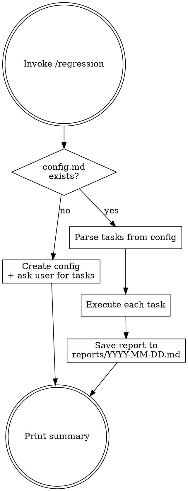

# Regression — Recurring Task Runner

Stateful skill with persistent config and reports.

```
~/.config/regression/
├── config.md              # Task definitions
└── reports/
    └── YYYY-MM-DD.md      # One report per run
```

## Flow



## Phase 1 — Initialization (no config file)

1. Create `~/.config/regression/config.md` with the template below
2. Ask user: "需要設定哪些 regression tasks？"
3. Show example tasks for reference
4. Write user's tasks into the config file
5. Done — next invocation will execute

### Config Template

```markdown
# Regression Tasks
<!-- Last run: never -->

## Tasks

### <task-name>
<plain language description of what to do>
```

Each `### ` heading is one task. The content under it is the instruction — written in natural language, no special format required. Just describe what you want done, like you would tell a person.

### Example Tasks

```markdown
### review-winlab-agent
Review ~/projects/winlab-agent for critical bugs and security issues.
Fix anything high severity and submit a PR for each fix.

### weekly-tech-digest
Go to Hacker News, find the top 10 AI/LLM/web dev stories from today.
Summarize each in 2-3 sentences and append to ~/documents/tech-digest.md
with today's date as a header.
```

## Phase 2 — Execution (config exists)

1. Read `~/.config/regression/config.md`
2. Parse all `### ` task blocks
3. For each task:
   - Read the instruction text
   - Execute it — use whatever tools and approaches are appropriate
   - Just do what the instruction says
4. If a task fails, log the error and continue to the next task
5. After all tasks complete:
   - Update `<!-- Last run: ... -->` in config.md with current timestamp
   - Save report to `~/.config/regression/reports/YYYY-MM-DD.md`
   - Print summary to user

## Phase 3 — Report Generation

After all tasks finish, create `~/.config/regression/reports/YYYY-MM-DD.md`:

```markdown
# Regression Report — YYYY-MM-DD

## Summary
| Metric | Count |
|--------|-------|
| Tasks executed | N |
| PRs created | N |
| Issues created | N |
| Tests added | N |
| Branches cleaned | N |

## Tasks

### <task-name>
- **Status**: done | failed
- **PRs**: #N (title), #N (title)
- **Issues**: #N (title)
- **Details**: <what was found and done>

### <task-name>
...
```

If multiple runs happen on the same day, append a counter: `YYYY-MM-DD-2.md`.

## Querying Reports

When user asks about regression reports (e.g. "regression 報告", "最近一次 regression", "上週跟這週比"):

1. List files in `~/.config/regression/reports/`
2. Read the relevant report(s)
3. Answer the question — summarize, compare, highlight trends

Examples:
- "regression 報告" → read latest report, summarize
- "上次 regression 結果" → read latest report
- "上週跟這週 regression 比較" → read both, diff the metrics
- "regression 歷史" → list all reports with dates and summary metrics

## Scheduling

For automated nightly runs, suggest `/schedule`:
```
/schedule regression --cron "0 1 * * *" --prompt "/regression"
```

Or just run `/regression` manually whenever needed.

## Modifying Tasks

Users can:
- Directly edit `~/.config/regression/config.md`
- Say `/regression add task` or `/regression remove <name>` to modify interactively
