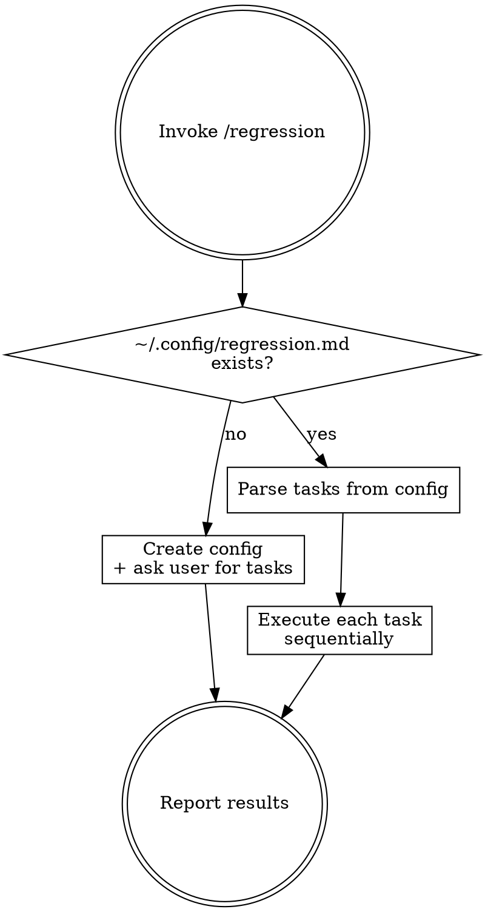

# Regression — Recurring Task Runner

Stateful skill with config at `~/.config/regression.md`. First run initializes; subsequent runs execute tasks.

## Flow



## Phase 1 — Initialization (no config file)

1. Create `~/.config/regression.md` with the template below
2. Ask user: "需要設定哪些 regression tasks？"
3. Show example tasks for reference
4. Write user's tasks into the config file
5. Done — next invocation will execute

### Config Template

```markdown
# Regression Tasks
<!-- Last run: never -->

## Tasks

### <task-name>
<plain language description of what to do>
```

Each `### ` heading is one task. The content under it is the instruction — written in natural language, no special format required. Just describe what you want done, like you would tell a person.

### Example Tasks

```markdown
### review-winlab-agent
Review ~/projects/winlab-agent for critical bugs and security issues.
Fix anything high severity and submit a PR for each fix.

### weekly-tech-digest
Go to Hacker News, find the top 10 AI/LLM/web dev stories from today.
Summarize each in 2-3 sentences and append to ~/documents/tech-digest.md
with today's date as a header.

### check-competitor-changelog
Check https://competitor.com/changelog for new entries since last run.
If there are new features, summarize them and append to ~/documents/competitor-watch.md.
```

## Phase 2 — Execution (config exists)

1. Read `~/.config/regression.md`
2. Parse all `### ` task blocks
3. For each task:
   - Read the instruction text
   - Execute it — use whatever tools and approaches are appropriate
   - If the task involves a repo: git pull, review, fix, branch, PR
   - If the task involves a URL: fetch, extract, summarize
   - If the task involves writing: create/append to the specified file
   - Just do what the instruction says
4. If a task fails, log the error and continue to the next task
5. After all tasks complete:
   - Update `<!-- Last run: ... -->` with current timestamp
   - Print summary:

```
| Task | Status | Details |
|------|--------|---------|
| review-winlab-agent | 2 PRs created | fix/null-check, fix/sql-injection |
| weekly-tech-digest | 5 articles added | ~/documents/tech-digest.md |
```

## Scheduling

For automated nightly runs, suggest `/schedule`:
```
/schedule regression --cron "0 1 * * *" --prompt "/regression"
```

Or just run `/regression` manually whenever needed.

## Modifying Tasks

Users can:
- Directly edit `~/.config/regression.md`
- Say `/regression add task` or `/regression remove <name>` to modify interactively
